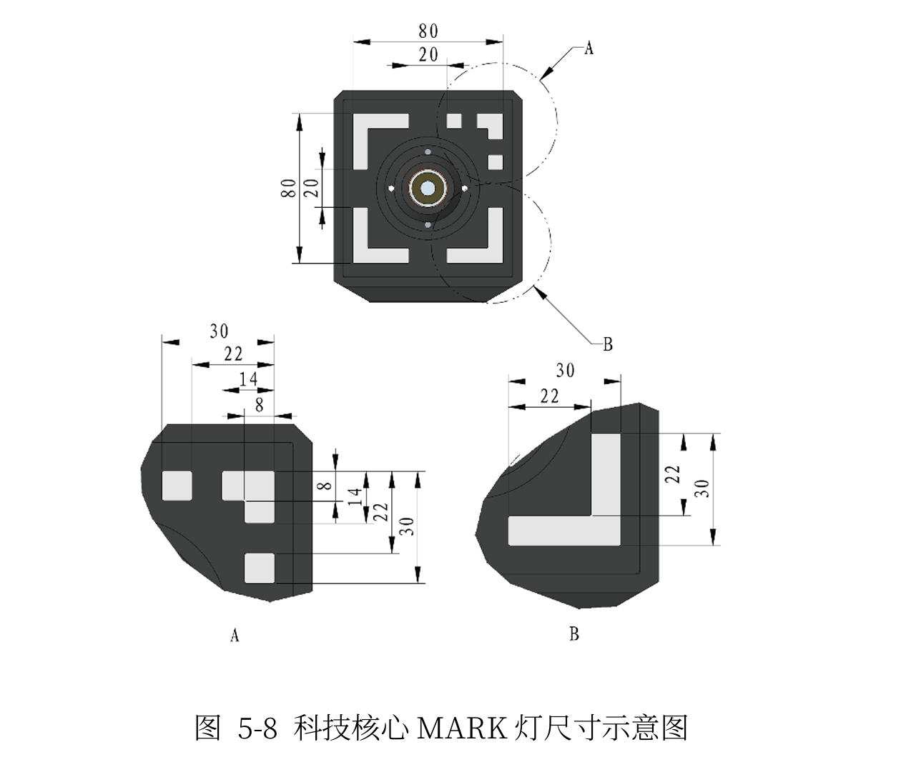

# 作业资料图片

本目录收录以下作业资料图片：

- [相机设置截图](camera_settings.png)：用于核对采集设置，不能替代相机标定结果。
- [科技核心 MARK 灯尺寸示意图](marker_dimensions.jpg)：原文件名为 `20260929-215212.jpg`，展示标志物外观、尺寸标注及 A/B 局部细节，可供关键点定义和位姿估计参考。使用尺寸进行建模时，应确认尺寸单位及各尺寸对应的几何位置。

